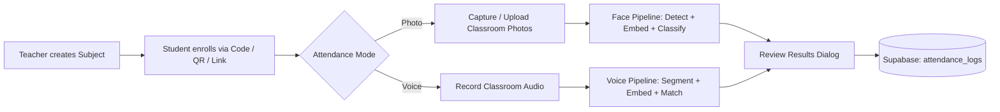

<div align="center">

# 🤖 SmartAttend

### AI-Powered Attendance Management System

*Face & Voice Recognition · Real-Time Sync · Zero Manual Roll Calls*

[](https://www.python.org/)
[](https://streamlit.io/)
[](https://supabase.com/)
[](#-license)


</div>

---

## 📌 Overview

**SmartAttend** replaces manual roll-calls with an automated pipeline that recognizes students from **classroom photos** or a **classroom audio clip**, cross-checks them against enrolled voice/face profiles, and writes verified attendance straight to a **Supabase** database — all inside a clean, dual-role (**Teacher** / **Student**) Streamlit interface.

| | |
|---|---|
| 🎯 **Purpose** | Eliminate manual attendance marking using biometric AI |
| 👥 **Roles** | Teacher (class owner) · Student (self-enrolls & views records) |
| 🧠 **Recognition** | Face (dlib + SVM classifier) & Voice (Resemblyzer speaker embeddings) |
| ☁️ **Backend** | Supabase (Postgres + Auth-style tables) |
| 🖌️ **UI Theme** | Custom Neo-Brutalism design system with light/dark mode |

---

## 🚀 Features

<div align="center">

| 🤖 AI | 🎓 Education | ☁️ Cloud |
|---|---|---|
| Face Recognition | Teacher Dashboard | Supabase |
| Voice Recognition | Student Portal | Real-time Sync |
| QR Enrollment | Analytics | Secure Database |
| Attendance Reports | Session Notes | bcrypt Auth |

</div>

- 📸 **Face Recognition Attendance** — capture/upload classroom photos, auto-detect & match faces
- 🎙️ **Voice Recognition Attendance** — record classroom audio, auto-segment speakers, match voiceprints
- 🔐 **Dual Authentication** — separate Teacher & Student login flows
- 🏫 **Subject Management** — create subjects, sections, and view class analytics
- 🔗 **QR & Link-Based Enrollment** — students self-enroll via shareable code, link, or scannable QR
- 📊 **Attendance Review & Confirmation** — preview AI results before committing to the database
- 📝 **Session Notes** — teachers can attach notes per subject/session
- 🌗 **Light/Dark Mode** — persistent theme toggle across the app
- ⚡ **Resilient DB Layer** — graceful handling of paused/offline Supabase projects

---

## 💡 Why SmartAttend?

```
✔ Eliminates manual attendance
✔ AI-powered Face Recognition
✔ AI-powered Voice Recognition
✔ QR-based Enrollment
✔ Modern Neo-Brutalist UI
✔ Secure Cloud Storage
✔ Real-time Attendance Sync
```

---

## 🛠️ Tech Stack

<div align="center">

| Layer | Technology |
|---|---|
| **Frontend / App Framework** | Streamlit |
| **Face Recognition** | dlib, face_recognition_models, scikit-learn (SVM) |
| **Voice Recognition** | Resemblyzer, librosa |
| **Database & Auth** | Supabase, bcrypt |
| **Data Handling** | NumPy, Pandas |
| **Media / QR** | Pillow, segno |

</div>

**Built With:** Python • Streamlit • Supabase • Dlib • Resemblyzer • Scikit-Learn • NumPy • Pandas • Librosa • Pillow

---

## 🏗️ System Architecture

```text
                Teacher
                   │
                   ▼
             Streamlit UI
                   │
                   ▼
            AI Pipelines
        ┌──────────┴──────────┐
        │                     │
  Face Recognition     Voice Recognition
        │                     │
        └──────────┬──────────┘
                   ▼
          Supabase Database
                   │
                   ▼
           Analytics & Reports
```

---

## 📂 Project Structure

```text
smartattend/
├── app.py                          # Entry point — routes Teacher / Student / Home screens
├── requirements.txt                # Python dependencies
├── README.md
│
└── src/
    ├── components/                 # Reusable UI dialogs & widgets
    │   ├── dialog_add_photo.py         # Camera / upload capture for attendance photos
    │   ├── dialog_attendance_results.py# Review + confirm AI attendance results
    │   ├── dialog_auto_enroll.py       # Enrollment via shared join-link
    │   ├── dialog_create_subject.py    # Teacher: create new subject
    │   ├── dialog_enroll.py            # Student: enroll via subject code
    │   ├── dialog_share_subject.py     # Generate shareable QR / link for a subject
    │   ├── dialog_voice_attendance.py  # Voice-based attendance workflow
    │   └── subject_card.py             # Neo-brutalist subject card UI
    │
    ├── database/
    │   ├── config.py                # Supabase client init + connection-error handling
    │   ├── db.py                    # All CRUD queries (students, subjects, attendance)
    │   └── session_notes.json       # Local cache of per-session teacher notes
    │
    ├── pipelines/
    │   ├── face_pipeline.py         # Face embedding extraction + SVM classifier
    │   └── voice_pipeline.py        # Voice embedding + speaker identification
    │
    └── ui/
        └── base_layout.py           # Global design system (tokens, CSS, themes)
```

> **Note:** `app.py` imports screen modules from `src/screens/` (home, teacher, student) — ensure this folder exists in your working copy, as it drives the top-level navigation.

---

## 🧬 AI Pipeline

<table>
<tr>
<th>📸 Face Recognition</th>
<th>🎙️ Voice Recognition</th>
</tr>
<tr>
<td>

```text
Image
  │
Face Detection
  │
128-D Embedding
  │
SVM Classification
  │
Attendance
```

</td>
<td>

```text
Audio
  │
Voice Segmentation
  │
Speaker Embedding
  │
Similarity Matching
  │
Attendance
```

</td>
</tr>
</table>

---

## 🔄 How It Works



1. **Enroll** — Teacher creates a subject; students join via code, link, or QR scan.
2. **Capture** — On attendance day, teacher captures classroom photos or records audio.
3. **Recognize** — The face pipeline (dlib landmarks → 128-d embeddings → SVM) or voice pipeline (Resemblyzer embeddings → cosine similarity) identifies present students.
4. **Review** — Results are shown in a confirmation dialog before anything is saved.
5. **Sync** — Confirmed attendance is written to Supabase and instantly available to students.

---

## ⚙️ Installation

### 1. Clone the repository
```bash
git clone https://github.com/ayushagarwal619/smartattend.git
cd smartattend
```

### 2. Create a virtual environment
```bash
python -m venv venv
```

Activate it:

| OS | Command |
|---|---|
| Windows | `venv\Scripts\activate` |
| macOS / Linux | `source venv/bin/activate` |

### 3. Install dependencies
```bash
pip install -r requirements.txt
```

### 4. Configure secrets
Create a `.streamlit/secrets.toml` file:
```toml
SUPABASE_URL = "your-supabase-project-url"
SUPABASE_KEY = "your-supabase-anon-or-service-key"
```

### 5. Run the app
```bash
streamlit run app.py
```

---

## 🗄️ Database Schema (Supabase)

| Table | Purpose |
|---|---|
| `teachers` | Teacher credentials & profile |
| `students` | Student profile, face & voice embeddings |
| `subjects` | Subject/course metadata, linked to a teacher |
| `subject_students` | Enrollment mapping (many-to-many) |
| `attendance_logs` | Per-session attendance records |

---

## 🎯 Roadmap

- [ ] Multi-factor teacher authentication
- [ ] Attendance analytics dashboard (trends, defaulter list)
- [ ] Automated email/SMS notifications
- [ ] Exportable attendance reports (CSV / PDF)
- [ ] Mobile-first responsive layout

---

## 🤝 Contributing

Contributions, issues, and feature requests are always welcome!
1. Fork the project
2. Create your feature branch (`git checkout -b feature/amazing-feature`)
3. Commit your changes (`git commit -m 'Add amazing feature'`)
4. Push to the branch (`git push origin feature/amazing-feature`)
5. Open a Pull Request

---

## 📜 License

Distributed under the **MIT License**. See `LICENSE` for more information.

---

<div align="center">

### 👨‍💻 Author

**Ayush Agarwal**
[GitHub](https://github.com/ayushagarwal619)

━━━━━━━━━━━━━━━━━━━━━━━━━━━━━━━━━━━━━━

**Made with ❤️ by Ayush KumAR Agarwal**
If you liked this project, please ⭐ the repository.

━━━━━━━━━━━━━━━━━━━━━━━━━━━━━━━━━━━━━━

</div>
